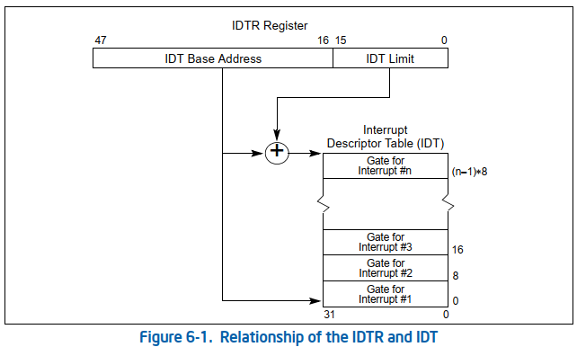

- [Linux 0.11 Summary](#linux-011-summary)
  - [Segment Descriptor Tables](#segment-descriptor-tables)
  - [Paging](#paging)
  - [Interrupt(IDT Descriptor)](#interruptidt-descriptor)
  - [TSS(Task-State Segment) and LDT(Local Descriptor Table)](#tsstask-state-segment-and-ldtlocal-descriptor-table)
    - [TSS Descriptor](#tss-descriptor)
    - [LDT Descriptor](#ldt-descriptor)
    - [System-Segment and Gate-Descriptor Types](#system-segment-and-gate-descriptor-types)
  - [Interrupt List](#interrupt-list)
    - [Stack Usage on interrupt and exception](#stack-usage-on-interrupt-and-exception)
    - [page fault](#page-fault)
  - [Sched Strategy](#sched-strategy)
    - [Init](#init)
    - [timer interrupt](#timer-interrupt)
# Linux 0.11 Summary

## Segment Descriptor Tables

A segment descriptor table is an array of segment descriptors. A descriptor table is variable in length and can contain up to 8192(2^13) 8-byte descriptors. There are two kinds of descriptor tables:
* The global descriptor table(GDT)
* The local descriptor table(IDT)

Each system must have one GDT defined, which may be used for all programs and tasks in the system.

The base linear address and limit of the GDT must be loaded into the GDTR register. The base address of the GDT should be aligned on an eight-byte boundary to yield the best processor performance. **The limit value for the GDT is expressed in byte**.

**Because segment descriptors are always 8 bytes long, the GDT limit should always be one less than an integral multiple of eight(that is, 8N-1)**.


## Paging


## Interrupt(IDT Descriptor)




* DPL: Descriptor Privilege Level
* Offset: Offset to procedure entry point
* P: Segment Present flag
* Selector: Segment Selector for destination code segment
* D: Size of gate: 1=32bits; 0=16bits

The only difference between an interrupt gate and a trap gate is the way the processor handles the IF flag in the EFLAGS register. **When accessing an exception- or interrupt-handling procedure through an interrupt gate, the processor clears the IF flag to prevent other interrupts from interfering with the current interrupt handler. A subsequent IRET instruction restores the IF flag to its value in the saved contents of the EFLAGS register on the stack**. Accessing a handler procedure through a trap gate doest not affect the IF flag.

```c
#define _set_gate(gate_addr, type, dpl, addr)\
__asm__("movw %%dx, %%ax\n\t"\
        "movw %0, %%dx\n\t"\
        "movl %%eax, %1\n\t"\
        "movl %%edx, %2"\
        :\
        :"i"((1 << 15) + (dpl << 13) + (type << 8)),\
        "o"(*((char*)(gate_addr))),\
        "o"(*((char*)(gate_addr) + 4)),\
        "d"((char*)(addr)),"a"((long)(8 << 16))
        )
//%edx初值复制为addr(即为偏移地址), %eax初值赋值为0x00080000(段选择值0x08)
//movw %%dx, %%ax 将addr低16位赋值到%eax的低16位
//movw %0, %%dx 将状态位(P,DPL,TYPE)赋值到%edx低16位
//movl %%eax, %1, 将%eax(4字节)赋值给陷阱门低4字节
//movl %%edx, %2, 将%ebx(4字节)赋值给陷阱门高4字节

#define set_intr_gate(n, addr)\
    _set_gate(&idt[n], 14, 0, addr)

#define set_trap_gate(n, addr)\
    _set_gate(&idt[n], 15, 0, addr)

#define set_system_gate(n, addr)\
    _set_gate(&idt[n], 15, 3, addr)
```

## TSS(Task-State Segment) and LDT(Local Descriptor Table)

The processor state information neeeded to restore a task is saved in a system segment called the task-state segment(TSS).


### TSS Descriptor

The TSS is defined by a segment descriptor. TSS descriptors may only be placed in the GDT; they cannot be placed in an LDT or the IDT.


### LDT Descriptor

A segment descriptor is a data structure in LDT that provides the processor with the size and location of a segment, as well as access control and status information.


### System-Segment and Gate-Descriptor Types

When the S(descriptor type) flag in a segment descriptor is clear, the descriptor type is a system descriptor.


```c
#define _set_tssldt_desc(n, addr, type)\
__asm__("movw $104, %1\n\t"\
        "movw %%ax, %2\n\t"\
        "rorl $16, %%eax\n\t"\
        "movb %%al, %3\n\t"\
        "movb $"type", %4\n\t"\
        "movb $0x00, %5\n\t"\
        "mov %%ah, %6\n\t"\
        "rorl $16, %%eax"\
        ::"a"(addr), "m"(*(n)), "m"(*(n+2)), "m"(*(n+4)),\
        "m"(*(n+5)),"m"(*(n+6)),"m"(*(n+7))\
        )

//%eax 初始赋值为addr
//movw $104, %1, 将104写入到segment limit低16位(TSS要求segment要大于0x67H=103)
//movw %%ax, %2, 将addr的低16位写入到Base Address低16位
//rorl $16, %%eax， 将addr右移16位，这时里面只有地址的高16位
//movb %%al, %3, 将addr高16位中的低8位写入到Base Address 23:16
//movb $"type", %4, 将8位的类型写入包括(P, DPL, S, TYPE)
//movb $0x00, %5, 将0写入segment limit19：16，包括置位G D/B L AVL
//mov %%ah, %6, 将addr高16位中的高8位写入到Base Address 31:24
//rorl $16, %%eax 右移16位，清零

#define set_tss_desc(n, addr) _set_tssldt_desc((char*)(n), addr, "0x89")
//0x89 P=1 DPL=0 Type=1001(binary)

#define set_ldt_desc(n, addr) _set_tssldt_desc((char*)(n), addr, "0x82")
//0x82 P=1 DPL=0 S=0(system) Type=0010(binary)
```

## Interrupt List

### Stack Usage on interrupt and exception


### page fault
中断汇编入口
```c
//page.s
_page_fault:
    xchgl %eax, (%esp) //获取错误码err_code
    pushl %ecx
    pushl %edx
    pushl %ds
    pushl %es
    pushl %fs
    movl $0x10, %edx    //使用系统段选择器ds,es,fs
    mov %dx, %ds
    mov %dx, %es
    mov %dx, %fs
    movl %cr2, %edx     //获取线性地址
    pushl %edx          //函数第二个参数 
    pushl %eax          //函数第一个参数
    testl $1, %eax      //判断是否缺页
    jne 1f
    call _do_no_page    //缺页处理
    jmp 2f
1:  call _do_wp_page    //页权限处理
2:  addl $8, %esp      
    pop %fs
    pop %es
    pop %ds
    popl %edx
    popl %ecx
    popl %eax
    iret    //中断返回
```

页权限保护处理(写保护处理)

```c
void do_wp_page(unsigned long error_code, unsigned long address)
{
//(address >> 20) & 0xffc 获取address对应PDT地址 4字节对齐
//(oxfffff000 & *(Point to PDT)) 获取PTE表的起始地址
//(address >> 10) & 0xffc 获取address在PTE表中偏移地址 4字节对齐
//最终获取PTE中4K的起始地址
    un_wp_page((unsigned long*)(((address >> 10) & 0xffc) + (0xfffff000 & *((unsigned long*)((address >> 20) & 0xffc)))));
}

void un_wp_page(unsigned long *table_entry)
{
    unsigned long old_page, new_page;

    old_page = 0xfffff000 & *table_entry;
    //如果该页存在，且只被一次引用(说明该页只需要赋值写权限即可)
    if(old_page >= LOW_MEM && mem_map[MAP_NR(old_page)] == 1){
        *table_entry |= 2; //赋值写权限
        invalidate(); //刷新cr3寄存器
        return;
    }

    //说明被引用次数大于1次，表示被多个进程共有，需要重新申请空间(即写时复制)
    //申请内存
    if(!(new_page = get_free_page())){
        oom();
    }
    if(old_page >= LOW_MEM){
        mem_map[MAP_NR(old_page)]--;
    }
    *table_entry = new_page | 7; //PTE页表赋值
    invalidate(); //刷新cr3寄存器
    copy_page(old_page, new_page); //复制4K数据
}

#define copy_page(from,to)\
__asm__("cld;rep;movsl"::"S"(from),"D"(to),"c"(1024):"cx","di","si")
```

缺页保护处理
```c
void do_no_page(unsigned long error_code, unsigned long address)
{
}
```

## Sched Strategy

### Init
```c
void sched_init()
{
    int i;
    struct desc_struct* p;
    //设置0号进程的TSS以及LDT
    set_tss_desc(gdt+FIRST_TSS_ENTRY, &(init_task.task.tss));
    set_ldt_desc(gdt+FIRST_LDT_ENTRY, &(init_task.task.ldt));
    //清空其他调度全局资源
    p = gdt + 2 + FIRST_TSS_ENTRY;
    for(int i = 1; i < NR_TASKS; i++)
    {
        task[i] = NULL;
        p->a = p->b = 0;
        p++;
        p->a = p->b = 0;
        p++;
    }
    //清楚NT标识，防止中断嵌套
    __asm__("pushfl; andl $0xffffbfff, (%esp); popfl");
    //设置TR寄存器以及LDT寄存器
    ltr(0);
    lldt(0);
    //设置定时器周期`
    outb_p(0x36, 0x43)
    outb_p(LATCH & 0xff, 0x40);
    outb(LATCH >> 8, 0x40);
    //设置时钟中断处理函数 
    set_intr_gate(0x20, &timer_interrupt);
    outb(inb_p(0x21) & ~0x01, 0x21);
    //设置系统调用中断处理函数
    set_system_gate(0x80, &system_call);
}

#define HZ 100
#define LATCH (1193180/HZ)

#define FIRST_TSS_ENTRY 4
#define FIRST_LDT_ENTRY (FIRST_TSS_ENTRY + 1)
#define _TSS(n) ((((unsigned long)n) << 4) + (FIRST_TSS_ENTRY << 3))
#define _TDT(n) ((((unsigned long)n) << 4) + (FIRST_LDT_ENTRY << 3))

#define ltr(n)  __asm__("ltr %%ax"::"a"(_TSS(n)))
#define lldt(n) __asm__("lldt %%ax"::"a"(_LDT(n)))
```


### timer interrupt
```c
_timer_interrupt:
    // save ds, es and put kernel data space
    // into them, %fs is used by _system_call
    push %ds    
    push %es
    push %fs    
    // save %eax,%ecx,%edx as gcc doesn't
    // save those across function calls. %ebx
    // is saved as we use that in ret_sys_call
    pushl %edx
    pushl %ecx
    pushl %ebx
    pushl %eax

    movl $0x10, %eax
    mov %ax, %ds
    mov %ax, %es
    movl $0x17, %eax
    mov %ax, %fs

    //递增时间计数器
    incl _jiffies

    //EOI to interrupt controller #1
    movb $0x20, %al
    outb %al, $0x20
    //CS = 20
    movl CS(%esp), %eax  
    //%eax is CPL(0 or 3, 0 = supervisor)
    andl $3, %eax
    pushl %eax
    //'do_timer(long CPL) does everything from task switching to accounting...'
    call _do_timer;
    addl $4, %esp
    jmp ret_from_sys_call
```


